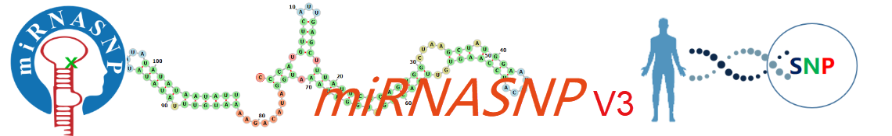

# miRNASNP-v3

 
microRNAs (miRNAs) are endogenous and regulatory non-coding RNAs by targeting mRNAs for cleavage or translational repression. SNPs on pre-miRNAs or target sites will affect miRNA expression or functions. miRNASNP is a comprehensive resource of human miRNA-related SNPs, including their effects on target gain and loss.

                
In miRNASNP-v3, 6,363,450 SNPs on human 1,897 pre-miRNAs(2,624 mature miRNAs) and 3'UTRs of 18,152 genes were characterized. Besides, 203,471 mutations from <a href="https://www.ncbi.nlm.nih.gov/clinvar/" target="_blank">ClinVar</a> and <a href="https://cancer.sanger.ac.uk/cosmic" target="_blank">COSMIC</a> were identified on the pre-miRNAs(2,065 on mature miRNAs, 522 on seed regions) and 3'UTRs. Gene enrichment of targets gained or lost by SNP in the miRNA seed region is provided.
                

